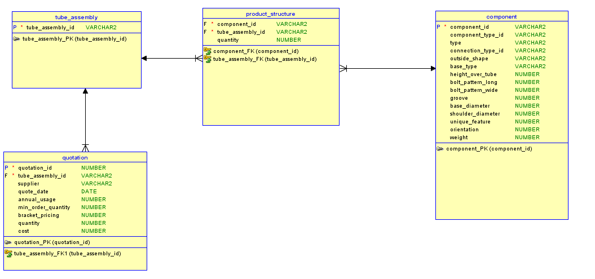

# Teste de Engenheiro de dados para o Grupo Dotz

Este material é parte do processo de seleção de Engenheiros de Dados do Grupo Dotz.

Para este desafio foi disponilizado um conjunto de dados de uma empresa que produz e vende máquinas industriais. O objetivo deste desafio é (1) Fazer a modelagem conceitual dos dados, (2) Criar a infraestrutura necessária e (3) criar todos os artefatos necessários para carregar os arquivos para o banco criado.

Para a realização deste teste foi sugerido a utilização dos recursos da nuvem do Google (GCP) e o Data Flow (GCP). 

## Desafios
- Estudo e familização com os serviços da GCP
- Criação de script para envio do Dataset para o Bucket da Google
- Criação de uma pipeline usando Apache Beam
- Utilização do DataFlow

# Requisito 1 - Modelagem conceitual dos Dados

Após um estudo da base, foi identificado a necessidade de criar basicamente 4 entidades e estabelecer uma cardinalidade N:M entre **Tube_Assembly** e **component**, para correção fugir da cardinalidade N:M foi inserido uma entidade chamada **product_structure**, assim:
- 1 conjunto pode ter 1 ou mais componentes;
- 1 componente pode estar presente em 1 ou mais conjuntos.
 

# Requisito 2 - Criação de uma Infraestrutura

Para este desafio, foi utilizados os seguintes GCP:
- Criação de um **Bucket** para armazenamento do Dataset usando GCS;
- Código de manipulação do DataSet;
- Criação de Tabelas no **BigQuery**

# Requisito 3 - Artefatos

Os codigos gerados podem ser visualizados no arquivo **desafio.ipynb**. Para abrir é necessario o uso do Jupyter.

Não consegui utilizar o DataFlow como sugerido, mas acredito que as construções usando o Apache Beam ser um preparativo para isso.

# Observações

A execução deste script requer que o Engenheiro de Dados possua uma conta ativa na GCP e que possua configurado localmente o a autenticacao. 

Esta execução pode causar COBRANÇA da GCP pelo uso dos serviços. É necessario observar o tempo de duração dos serviços para não causar prejuízo. 

O arquivo **desafio.ipynb** possui comandos para a configuração dos serviços GCP e também possui a liberação dos serviços, visando não gerar custo desnecessario.

Sugiro rodar *step* a *step* para avaliação dos códigos.

**Obrigado Dotz pelo desafio, foi o meu primeiro contato com a GCP.**

